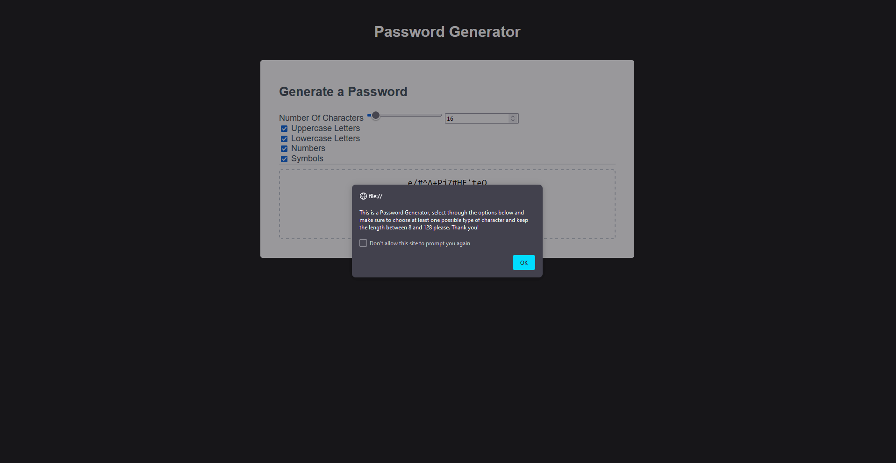

# Password Generator

## Description

This project was started with the intent to create a javascript file that creates and displays a password into the textarea box. I decided to add checkboxes and a slider for the user to choose their criteria for their password. 

## Example of Password Generator

## Usage

To use this webpage you first start by selecting your length of your password that you would like and then you can select from the checkboxes for which characters you would like to allow in your password. The password automatically updates as you change your criteira and allows you to have your password made to the exact length that you would like.

## Credits

I used lots of https://www.w3schools.com/ references to understand certain functions of my webpage and I was very grateful for the open database of for lots of information as well as https://stackoverflow.com/ for certain specific cases.

## License

Please refer to the LICENSE in the repo
